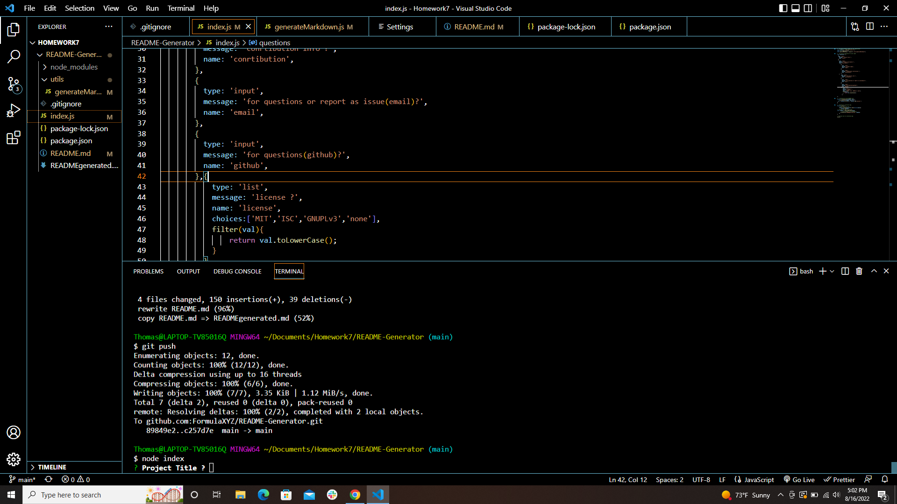
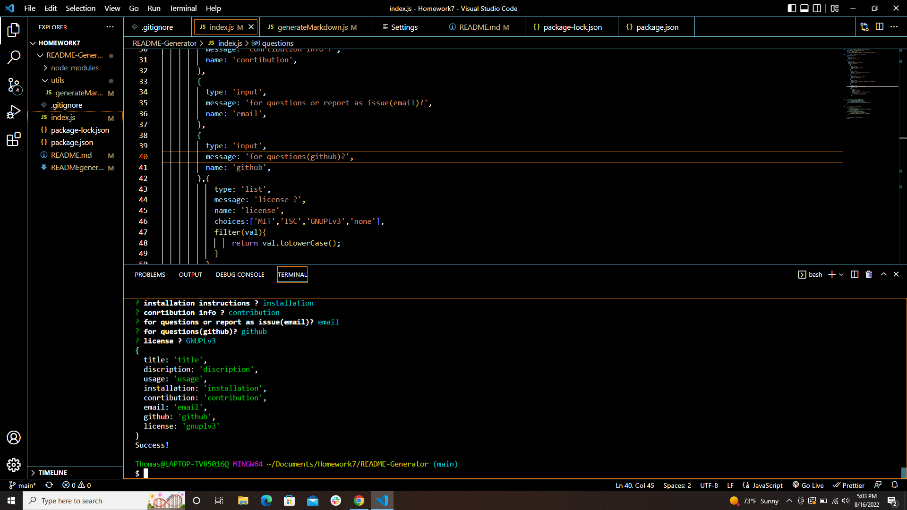
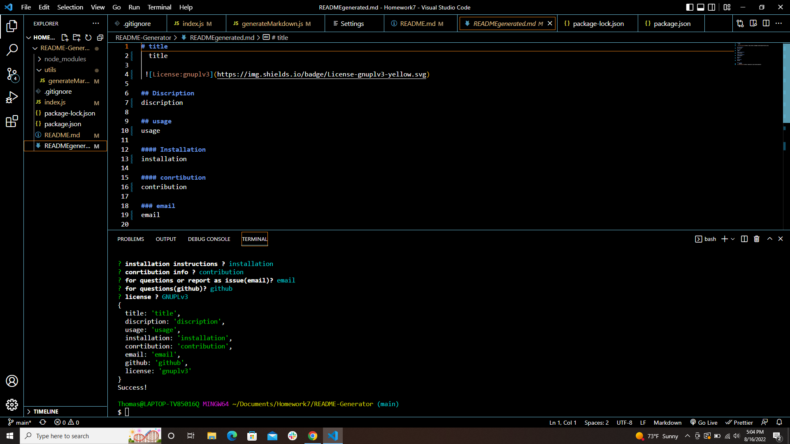

#  Node.js: Professional README Generator
 [ link](https://drive.google.com/file/d/1m3Lcw3ZLPoIH5mmKBp2TKKquCq3H1CD8/view)

	
## usage

   by using this  application the user can create a proffesional README file.because its give the user a choices,include what the app is for, how to use the app, how to install it, how to report issues, and how to make contributions&mdash;if developers will contribute to the success of the project. When creating an open source project on GitHub, it’s important to have a high-quality README for the app.

You can quickly and easily create a README file by using a command-line application to generate one. 

This application is  created a command-line application that dynamically generates a professional README.md file from a user's input. 

 ## description

The application will be invoked by using the following command:

bash
node index.js

command-line application that accepts user input,WHEN the user prompted for information about  application repository
 professional README.md is generated with the title of the user project and sections entitled Description, Table of Contents,
 Installation, Usage, License, Contributing,  and Questions
WHEN the user enter the project title ,it  displayed as the title of the README. WHEN the user enter a description, 
installation instructions, usage information, contribution guidelines.
THEN this information is added to the sections of the README entitled Description, Installation, Usage, and Contributing.
WHEN the user choose a license for the application from a list of options.THEN a badge for that license is added near the top of the README.
 and a notice is added to the section of the README entitled License that explains which license the application is covered under
WHEN the user enter  GitHub username,THEN this is added to the section of the README entitled Questions, with a link to the user GitHub profile.
WHEN the user  enter an email address, this is added to the section of the README.
WHEN the user click on the links in the Table of Contents,THEN the user taken to the corresponding section of the README

